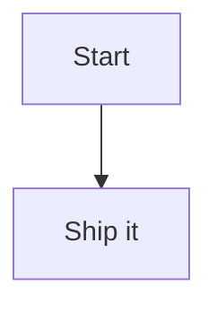

# MermaidLens

MermaidLens is a VS Code extension (compatible with Cursor) that renders Mermaid code fences inline in the Markdown Preview, with a plug-and-play system for Mermaid themes and presets.

**Repository:** [github.com/sraphaz/mermaidLens](https://github.com/sraphaz/mermaidLens)

## Features

- ✅ Inline Mermaid diagrams inside Markdown Preview.
- ✅ Ocean theme enabled by default.
- ✅ Extensible theme engine (`packages/themes/*`).
- ✅ Mermaid presets (directives) auto-injected (`packages/presets/*`).

## Getting started

```bash
npm install --include=dev
npm run build
```

Press **F5** in VS Code/Cursor to launch the extension development host. Open a Markdown file, add a Mermaid code block, and open the preview.



## Testing

```bash
npm test
```

## Configuration

Set these in your VS Code/Cursor settings:

- `mermaidlens.theme`: Theme id (default: `ocean`).
- `mermaidlens.preset`: Preset id (default: `architecture`).

## Adding a new theme

1. Copy the template folder: `packages/themes/template` → `packages/themes/<your-theme-id>`.
2. Update `theme.json` with your theme variables.
3. Run `npm run build` and test in the Markdown preview.

## Adding a new preset

1. Create a new folder under `packages/presets/<your-preset-id>`.
2. Add a `preset.json` file with Mermaid directives.
3. Set `mermaidlens.preset` to your preset id and refresh the preview.

## Troubleshooting

- **Punycode / SQLite warnings in console:** When launching with F5, we set `NODE_OPTIONS=--no-deprecation --no-warnings` in `.vscode/launch.json` to silence these Node/VS Code messages. They do not affect the extension.
- **"No diagram type detected":** Ensure your Mermaid block starts with `graph`, `flowchart`, `sequenceDiagram`, `gantt`, `pie`, etc. Empty blocks show a placeholder.
