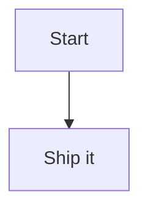

# MermaidLens

MermaidLens is a VS Code extension (compatible with Cursor) that renders Mermaid code fences inline in the Markdown Preview, with a plug-and-play system for Mermaid themes and presets.

**Repository:** [github.com/sraphaz/mermaidLens](https://github.com/sraphaz/mermaidLens)

The extension icon (`extension/media/icone.png`) is used in the **VS Code Marketplace** and **Git** (e.g. repo, README). It is not shown in the Markdown preview.

## Features

- ✅ Inline Mermaid diagrams inside Markdown Preview.
- ✅ Optional **diagram on hover** (toggle): placeholder "View diagram" → hover shows the diagram.
- ✅ Ocean theme by default; extensible themes (`packages/themes/*`) and presets (`packages/presets/*`).

## Getting started

```bash
npm install --include=dev
npm run build
```

Press **F5** in VS Code/Cursor to launch the extension development host. Open a Markdown file, add a Mermaid code block, and open the preview.



## Testing

```bash
npm test
```

## Configuration

Set these in your VS Code/Cursor settings:

- `mermaidlens.theme`: Theme id (default: `ocean`).
- `mermaidlens.preset`: Preset id (default: `none`). Use `none` to avoid init blocks; use `architecture` for flowchart tweaks.
- `mermaidlens.diagramOnHover`: When `true`, the diagram is **shown on hover** over a "View diagram" placeholder (no icon in preview). Turn off to always show diagrams inline.

## Adding a new theme

1. Copy the template folder: `packages/themes/template` → `packages/themes/<your-theme-id>`.
2. Update `theme.json` with your theme variables.
3. Run `npm run build` and test in the Markdown preview.

## Adding a new preset

1. Create a new folder under `packages/presets/<your-preset-id>`.
2. Add a `preset.json` file with Mermaid directives.
3. Set `mermaidlens.preset` to your preset id and refresh the preview.

## Publishing

- **VSIX:** `npm run package:vsix` (requires Node 20+). Output: `extension/mermaidlens-extension-<version>.vsix`.
- **CI/CD:** Push to `main` runs CI (build, test, package). Creating a **GitHub Release** (e.g. `v0.2.1`) runs the Release workflow: it builds, packages, uploads the VSIX to the release, and **publishes to the VS Code Marketplace** if the `VS_MARKETPLACE_TOKEN` secret is set.
- **Marketplace token:** Create a [Personal Access Token](https://code.visualstudio.com/api/working-with-extensions/publishing-extension#get-a-personal-access-token) (Azure DevOps) for the Marketplace, add it as repository secret `VS_MARKETPLACE_TOKEN`, then publish a release. Without it, the workflow still uploads the VSIX to the release and as an artifact.

## Troubleshooting

- **Punycode / SQLite warnings in console:** When launching with F5, we set `NODE_OPTIONS=--no-deprecation --no-warnings` in `.vscode/launch.json` to silence these Node/VS Code messages. They do not affect the extension.
- **"No diagram type detected":** Ensure your Mermaid block starts with `graph`, `flowchart`, `sequenceDiagram`, `gantt`, `pie`, etc. Empty blocks show a placeholder.
