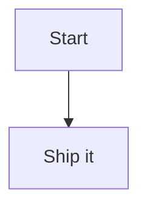

# MermaidEyes

MermaidEyes is a VS Code extension (compatible with Cursor) that renders Mermaid code fences inline in the Markdown Preview, with a plug-and-play system for Mermaid themes and presets.

**Repository:** [github.com/sraphaz/mermaidEyes](https://github.com/sraphaz/mermaidEyes)

The extension icon (`extension/media/icone.png`) is used in the **VS Code Marketplace** and **Git** (e.g. repo, README). It is not shown in the Markdown preview.

## Features

- ✅ **Inline Mermaid diagrams** inside Markdown Preview, with theme colors (Ocean, Coral Reef, etc.).
- ✅ **Hover no editor:** ao passar o mouse sobre um bloco Mermaid no Markdown, aparece uma caixa com o diagrama renderizado (cores do tema) e link para abrir o preview.
- ✅ **View with MermaidEyes:** comando para abrir o preview ao lado do arquivo ativo (menu do editor, barra de título ou botão direito no explorador em arquivos `.md`).
- ✅ **Primeira instalação:** na primeira vez após instalar, a extensão abre a página de boas-vindas e o preview ao lado automaticamente.
- ✅ **Diagram on hover (preview):** opção `mermaideyes.diagramOnHover` — placeholder "View diagram" → hover ou clique mostra o diagrama no preview.
- ✅ **Temas e presets:** Ocean por padrão; temas em `packages/themes/*` e presets em `packages/presets/*`.

## Getting started

```bash
npm install --include=dev
npm run build
```

Press **F5** in VS Code/Cursor to launch the extension development host. Open a Markdown file, add a Mermaid code block, and open the preview.



## Testing

```bash
npm test
```

## Configuration

Set these in your VS Code/Cursor settings:

- `mermaideyes.theme`: Theme id (default: `ocean`).
- `mermaideyes.preset`: Preset id (default: `none`). Use `none` to avoid init blocks; use `architecture` for flowchart tweaks.
- `mermaideyes.diagramOnHover`: When `true`, the diagram is **shown on hover** over a "View diagram" placeholder (no icon in preview). Turn off to always show diagrams inline.

## Adding a new theme

1. Copy the template folder: `packages/themes/template` → `packages/themes/<your-theme-id>`.
2. Update `theme.json` with your theme variables.
3. Run `npm run build` and test in the Markdown preview.

## Adding a new preset

1. Create a new folder under `packages/presets/<your-preset-id>`.
2. Add a `preset.json` file with Mermaid directives.
3. Set `mermaideyes.preset` to your preset id and refresh the preview.

## Publishing

- **VSIX:** `npm run package:vsix` (requires Node 20+). Output: `extension/mermaideyes-extension-<version>.vsix`.
- **Publicar localmente:** defina `VS_MARKETPLACE_TOKEN` (ambiente ou `.env`) e rode `npm run publish:marketplace` (faz build, empacota e publica no Marketplace).
- **Release automático (CI/CD):**
  - Ao fazer **push em `master`** com alteração de versão em `extension/package.json` (ou `package.json`), o workflow **Tag on version bump** cria e envia a tag `vX.Y.Z`.
  - O **push da tag** dispara o workflow **Release**: roda os testes; se passarem, faz build, empacota, publica no Marketplace (usando o secret `VS_MARKETPLACE_TOKEN`) e anexa o VSIX à release no GitHub.
  - Ou crie uma **GitHub Release** manualmente (tag `v0.x.x`) ou use **Actions → Release → Run workflow** com o tag desejado.
- **Token do Marketplace:** crie um [Personal Access Token](https://code.visualstudio.com/api/working-with-extensions/publishing-extension#get-a-personal-access-token) (Azure DevOps), adicione como secret do repositório `VS_MARKETPLACE_TOKEN`. Sem o token, o workflow ainda gera e anexa o VSIX à release.

## Troubleshooting

- **Punycode / SQLite warnings in console:** When launching with F5, we set `NODE_OPTIONS=--no-deprecation --no-warnings` in `.vscode/launch.json` to silence these Node/VS Code messages. They do not affect the extension.
- **"No diagram type detected":** Ensure your Mermaid block starts with `graph`, `flowchart`, `sequenceDiagram`, `gantt`, `pie`, etc. Empty blocks show a placeholder.
