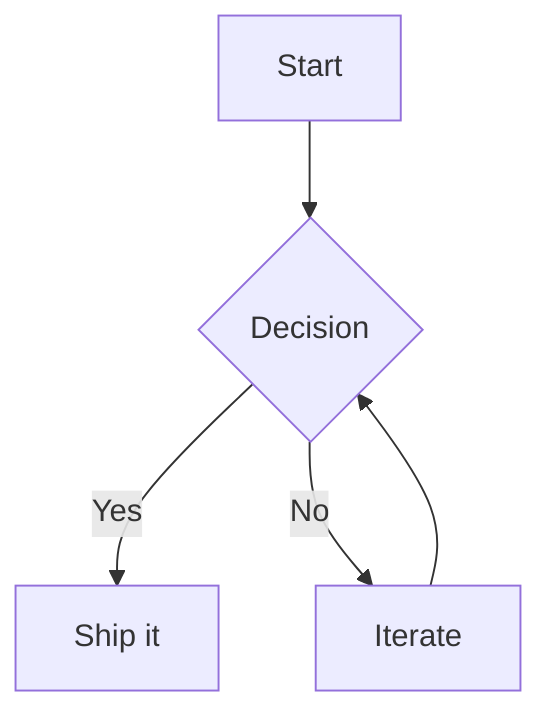
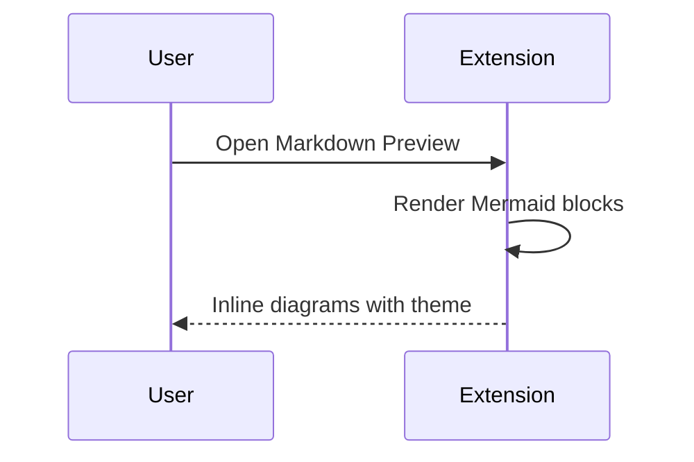
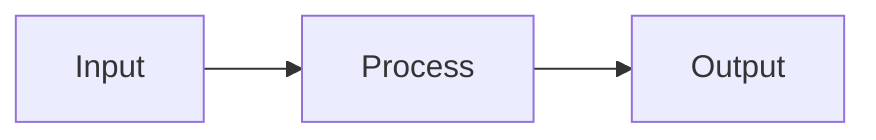

# MermaidEyes

Inline Mermaid diagrams in the Markdown Preview — themes, presets, and hover preview. Compatible with VS Code and Cursor.

[](https://github.com/sraphaz/mermaidEyes/actions/workflows/ci.yml)
[](https://github.com/sraphaz/mermaidEyes/actions/workflows/release.yml)
[](https://marketplace.visualstudio.com/items?itemName=sraphaz.mermaideyes-extension)
[](https://opensource.org/licenses/MIT)
[](https://github.com/sraphaz/mermaidEyes)

---

## Table of contents

- [Features](#features)
- [Getting started](#getting-started)
- [Examples](#examples)
- [Configuration](#configuration)
- [Commands](#commands)
- [CI / CD & Release](#ci--cd--release)
- [Development](#development)
- [Troubleshooting](#troubleshooting)
- [Links](#links)

---

## Features

- **Inline Mermaid diagrams** — Renders ` ```mermaid ` code fences directly in the Markdown Preview with theme colors (Ocean, Coral Reef, etc.).
- **Hover in editor** — Hover over a Mermaid block in the editor to see the diagram and a link to open the preview.
- **View with MermaidEyes** — Command to open the preview next to the active file (editor title bar, context menu, or explorer right-click on `.md` files).
- **First install** — Welcome page and preview open automatically after installation.
- **Diagram on hover (preview)** — Optional `mermaideyes.diagramOnHover` setting: show a "View diagram" placeholder; hover or click to reveal the diagram.
- **Themes and presets** — Ocean by default; configurable themes and presets (e.g. `architecture` for flowcharts).

---

## Getting started

1. **Install** the extension from the [Marketplace](https://marketplace.visualstudio.com/items?itemName=sraphaz.mermaideyes-extension) or from [Releases](https://github.com/sraphaz/mermaidEyes/releases) (VSIX).
2. **Open** a Markdown file (`.md`).
3. **Add** a Mermaid code block (see [Examples](#examples)).
4. **Open** the Markdown Preview (`Ctrl+Shift+V` / `Cmd+Shift+V`) or use **View with MermaidEyes**. Diagrams render inline with your chosen theme.

---

## Examples

### Flowchart



### Sequence diagram



### Flowchart (LR)



Your Mermaid block must start with a diagram type keyword: `graph`, `flowchart`, `sequenceDiagram`, `gantt`, `pie`, `stateDiagram`, etc. Empty or invalid blocks show a placeholder.

---

## Configuration

| Setting | Type | Default | Description |
|--------|------|---------|-------------|
| `mermaideyes.theme` | string | `ocean` | Theme id for Mermaid rendering (e.g. `ocean`, `coralreef`). |
| `mermaideyes.preset` | string | `none` | Preset id for Mermaid directives. Use `none` to avoid init blocks; use `architecture` for flowchart tweaks. |
| `mermaideyes.diagramOnHover` | boolean | `false` | When `true`, shows a "View diagram" placeholder in the preview; hover or click to reveal. When `false`, diagrams are always shown inline. |

Open **Settings** and search for `mermaideyes` to change these.

---

## Commands

| Command | Description |
|--------|-------------|
| **MermaidEyes: Refresh Preview** | Refreshes the Markdown preview (e.g. after changing theme or preset). |
| **MermaidEyes: Show Welcome Page** | Opens the welcome / getting-started page. |
| **MermaidEyes: Edit Diagram** | Edit the diagram under the cursor (from preview). |
| **View with MermaidEyes** | Opens the Markdown preview with MermaidEyes (editor title, context menu, explorer). |

---

## CI / CD & Release

The project uses GitHub Actions for packaging and publishing.

### Version bump → tag

- **Workflow:** [Tag on version bump](https://github.com/sraphaz/mermaidEyes/blob/master/.github/workflows/tag-on-version-bump.yml)
- **Trigger:** Push to `master` when `extension/package.json` or `package.json` version changes.
- **Behavior:** Creates and pushes a tag `vX.Y.Z` (e.g. `v0.2.6`). Tags are only created if they do not already exist (remote tags are fetched before checking).

### Tag → build & publish

- **Workflow:** [Release](https://github.com/sraphaz/mermaidEyes/blob/master/.github/workflows/release.yml)
- **Trigger:** Push of a tag matching `v*` (e.g. `v0.2.6`), or manual run via **Actions → Release → Run workflow** with a tag input.
- **Steps:**
  1. Checkout at the tag ref.
  2. Create GitHub Release for the tag (if it does not exist).
  3. Set extension version from the tag, run tests, build, and prepack for `vsce`.
  4. Package the VSIX with `@vscode/vsce package --no-dependencies`.
  5. Publish to the [VS Code Marketplace](https://marketplace.visualstudio.com/) using the `VS_MARKETPLACE_TOKEN` secret (Azure DevOps Personal Access Token).
  6. Upload the VSIX to the GitHub Release and as a workflow artifact.

### Manual release

- **Create a release:** [GitHub Releases](https://github.com/sraphaz/mermaidEyes/releases) → **Draft a new release** → choose or create tag `vX.Y.Z`.
- **Run release from Actions:** **Actions → Release → Run workflow** → enter tag (e.g. `v0.2.6`) and run.

### Secrets

- `VS_MARKETPLACE_TOKEN` — [Personal Access Token](https://code.visualstudio.com/api/working-with-extensions/publishing-extension#get-a-personal-access-token) (Azure DevOps) with **Marketplace (Publish)** scope. Without it, the Release workflow still builds and attaches the VSIX to the GitHub Release but does not publish to the Marketplace.

---

## Development

```bash
# From repository root
npm install --include=dev
npm run build
```

Press **F5** in VS Code/Cursor to launch the Extension Development Host. Open a Markdown file, add a Mermaid block, and open the preview.

```bash
npm test
```

---

## Troubleshooting

| Issue | Solution |
|-------|----------|
| **"No diagram type detected"** | Ensure the Mermaid block starts with `graph`, `flowchart`, `sequenceDiagram`, `gantt`, `pie`, etc. Empty or invalid blocks show a placeholder. |
| **Diagrams not updating** | Use **MermaidEyes: Refresh Preview** from the command palette or reopen the preview. |
| **Wrong theme or preset** | Check `mermaideyes.theme` and `mermaideyes.preset` in Settings; refresh the preview after changing. |
| **Console warnings (Punycode, SQLite)** | When running from source (F5), these can be silenced via `NODE_OPTIONS` in `.vscode/launch.json`; they do not affect the extension. |

---

## Links

- [Repository](https://github.com/sraphaz/mermaidEyes)
- [Releases (VSIX)](https://github.com/sraphaz/mermaidEyes/releases)
- [Issues](https://github.com/sraphaz/mermaidEyes/issues)
- [Marketplace](https://marketplace.visualstudio.com/items?itemName=sraphaz.mermaideyes-extension)
