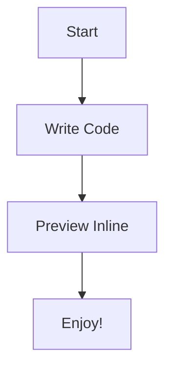
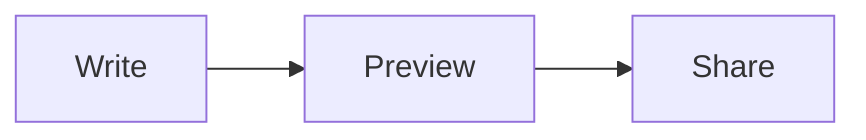
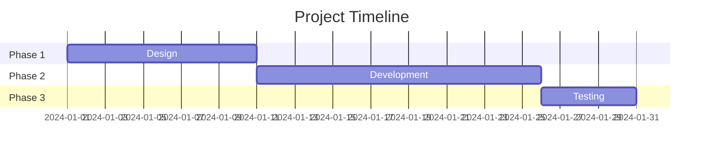
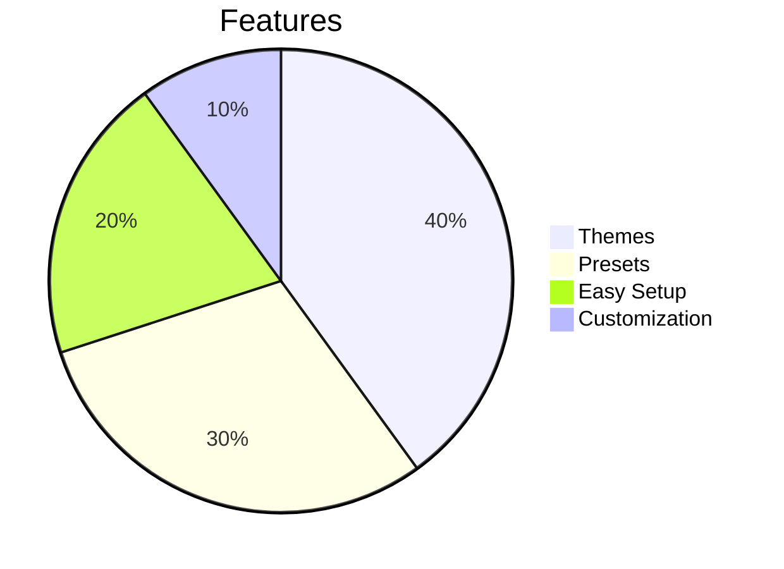

<p align="center">
  
</p>

# 🌊 MermaidEyes

[](https://github.com/sraphaz/mermaidEyes/actions/workflows/ci.yml)
[](https://github.com/sraphaz/mermaidEyes/actions/workflows/release.yml)
[](https://github.com/sraphaz/mermaidEyes/releases)

Welcome to **MermaidEyes** — magical Mermaid diagrams rendered inline inside Markdown Preview!

**👉 [Abrir preview ao lado](command:markdown.showPreviewToSide)** — clique se o preview não abriu sozinho.

---

## 🎯 Quick Start

### 1) Write Mermaid inside Markdown

Simply add a Mermaid code block in your Markdown file:

````markdown

````

### 2) Open the Markdown Preview

- **Windows/Linux**: `Ctrl+Shift+V`
- **macOS**: `Cmd+Shift+V`

Or use the preview button in the editor toolbar.

### 3) See your diagrams come to life! ✨

MermaidEyes automatically renders your Mermaid code into beautiful, styled diagrams.

**Two display modes:**

- **Inline (default):** Diagrams are always visible in the preview.
- **Diagram on hover:** When enabled in settings, you see a **"View diagram"** placeholder; **hover** over it to reveal the diagram. Useful to reduce clutter or focus on text first.

---

## 📊 Demo: Different Diagram Types

### Flowchart



### Sequence Diagram


### Gantt Chart



### Pie Chart



---

## 🎨 Themes & Presets

MermaidEyes comes with beautiful themes and presets out of the box!

### Available Themes
- **Ocean** (default) - Deep blue ocean vibes 🌊
- **Coral Reef** - Warm coral tones 🪸

### Available Presets
- **Architecture** - Clean, professional diagrams
- **Sequence Clean** - Minimalist sequence diagrams

### Change Settings

- 👉 [Open MermaidEyes Settings](command:workbench.action.openSettings?%22mermaideyes%22)

You can change:
- `mermaideyes.theme` - Choose your theme
- `mermaideyes.preset` - Choose your preset
- `mermaideyes.diagramOnHover` - When **true**, diagrams are hidden behind a "View diagram" placeholder; **hover** over the placeholder to show the diagram. When **false** (default), diagrams are always shown inline.

---

## 💡 Tips

1. **Refresh Preview**: Use `Ctrl+Shift+V` (or `Cmd+Shift+V` on Mac) to refresh the preview
2. **Command Palette**: Press `Ctrl+Shift+P` and type "MermaidEyes" to see all commands
3. **Reopen Welcome**: Use the command "MermaidEyes: Show Welcome Page" anytime
4. **"View diagram" / hover**: If you see **View diagram** instead of a diagram, **hover** over the placeholder (move the mouse over it) to reveal the diagram. To always see diagrams inline on this page, turn off `mermaideyes.diagramOnHover` in settings.

---

## 🔧 CI & Release

- **CI:** Runs on every push and pull request to `main`/`master` (build, test, package VSIX). See [Actions](https://github.com/sraphaz/mermaidEyes/actions).
- **Release:** Creating a [GitHub Release](https://github.com/sraphaz/mermaidEyes/releases) (e.g. `v0.2.2`) triggers the release workflow: it builds the extension, packages the VSIX, uploads it to the release, and can publish to the VS Code Marketplace if `VS_MARKETPLACE_TOKEN` is configured.
- **Install from VSIX:** Download the `.vsix` from the [Releases](https://github.com/sraphaz/mermaidEyes/releases) page and install via **Extensions** → **...** → **Install from VSIX**.

---

## 📚 Learn More

- 📘 [Mermaid Documentation](https://mermaid.js.org/)
- 🐙 [MermaidEyes Repository](https://github.com/sraphaz/mermaidEyes)

---

**Happy diagramming!** 🐚✨

> 💡 **Tip**: This page itself contains Mermaid diagrams! Open the preview (`Ctrl+Shift+V`) to see them rendered.
