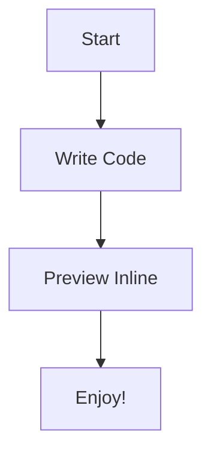
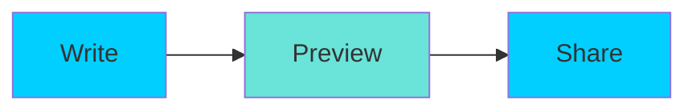
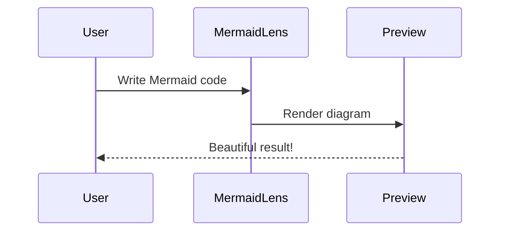
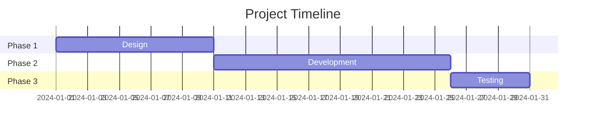
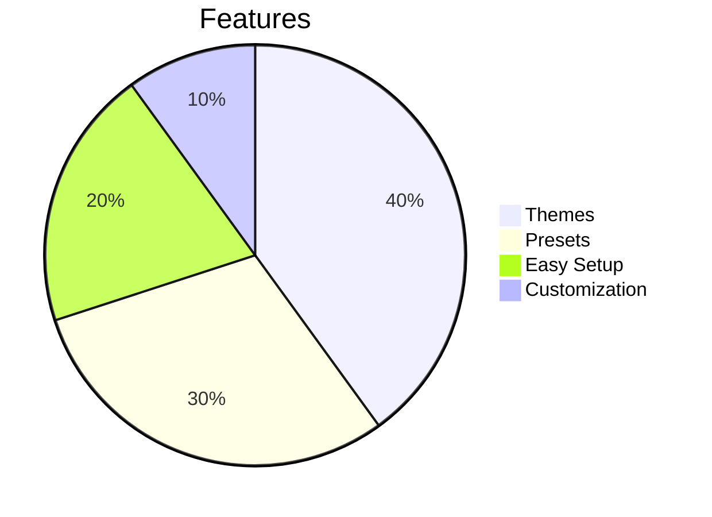

<p align="center">
  
</p>

# 🌊 MermaidLens

Welcome to **MermaidLens** — magical Mermaid diagrams rendered inline inside Markdown Preview!

---

## 🎯 Quick Start

### 1) Write Mermaid inside Markdown

Simply add a Mermaid code block in your Markdown file:

````markdown

````

### 2) Open the Markdown Preview

- **Windows/Linux**: `Ctrl+Shift+V`
- **macOS**: `Cmd+Shift+V`

Or use the preview button in the editor toolbar.

### 3) See your diagrams come to life! ✨

MermaidLens automatically renders your Mermaid code into beautiful, styled diagrams.

---

## 📊 Demo: Different Diagram Types

### Flowchart



### Sequence Diagram



### Gantt Chart



### Pie Chart



---

## 🎨 Themes & Presets

MermaidLens comes with beautiful themes and presets out of the box!

### Available Themes
- **Ocean** (default) - Deep blue ocean vibes 🌊
- **Coral Reef** - Warm coral tones 🪸

### Available Presets
- **Architecture** - Clean, professional diagrams
- **Sequence Clean** - Minimalist sequence diagrams

### Change Settings

- 👉 [Open MermaidLens Settings](command:workbench.action.openSettings?%22mermaidlens%22)

You can change:
- `mermaidlens.theme` - Choose your theme
- `mermaidlens.preset` - Choose your preset

---

## 💡 Tips

1. **Refresh Preview**: Use `Ctrl+Shift+V` (or `Cmd+Shift+V` on Mac) to refresh the preview
2. **Command Palette**: Press `Ctrl+Shift+P` and type "MermaidLens" to see all commands
3. **Reopen Welcome**: Use the command "MermaidLens: Show Welcome Page" anytime

---

## 📚 Learn More

- 📘 [Mermaid Documentation](https://mermaid.js.org/)
- 🐙 [MermaidLens Repository](https://github.com/sraphaz/mermaidLens)

---

**Happy diagramming!** 🐚✨

> 💡 **Tip**: This page itself contains Mermaid diagrams! Open the preview (`Ctrl+Shift+V`) to see them rendered.
