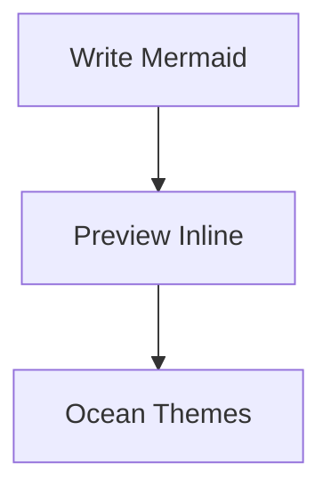

  

# 🌊 MermaidLens

Welcome to **MermaidLens** — magical Mermaid diagrams rendered inline inside Markdown.

---

## ✅ How to use

### 1) Write Mermaid inside Markdown

### 2) Open the Markdown Preview

- **Windows/Linux**: `Ctrl+Shift+V`
- **macOS**: `Cmd+Shift+V`

### 3) Enjoy inline diagrams ✨

MermaidLens automatically transforms Mermaid code into beautiful diagrams.

---

## 🎨 Themes & Presets

You can change themes and presets in Settings.

- 👉 [Open MermaidLens Settings](command:workbench.action.openSettings?%22mermaidlens%22)

For documentation and updates:

- 📘 [Read MermaidLens Docs](https://github.com/)

---

Happy diagramming! 🐚
